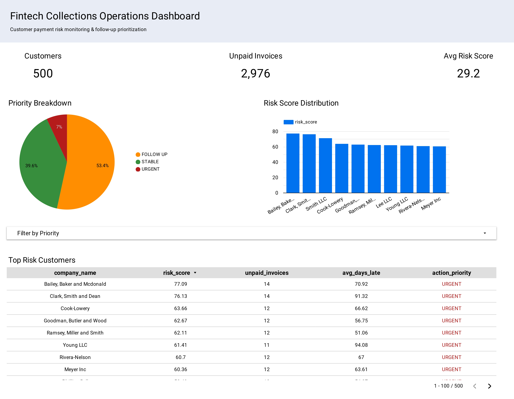

# Fintech Collections Risk Monitoring System

## Overview
This project simulates a fintech collection monitoring system that analyzes invoice payment behavior, calculates customer risk scores, and helps operations teams prioritize follow-ups.

## Tech Stack
- BigQuery (Data Warehouse)
- SQL (Risk logic & analytics)
- Python (Synthetic data generation)
- Looker Studio (Dashboard)

## Data Pipeline
Synthetic Data → BigQuery Tables → Risk Logic Views → Operations Dashboard

## Key Features
- Payment delay calculation using due date vs payment date
- Invoice risk classification (Paid Late / Unpaid / High Risk)
- Customer-level risk scoring model
- Operational priority tagging (URGENT / FOLLOW UP / STABLE)
- Interactive monitoring dashboard

## Dashboard Preview

## Business Impact
Helps operations teams identify high-risk customers early and prioritize collections efforts efficiently.

## What I Learned
- Handling NULL logic with LEFT JOIN
- Building reusable SQL views
- Translating business rules into analytics logic
